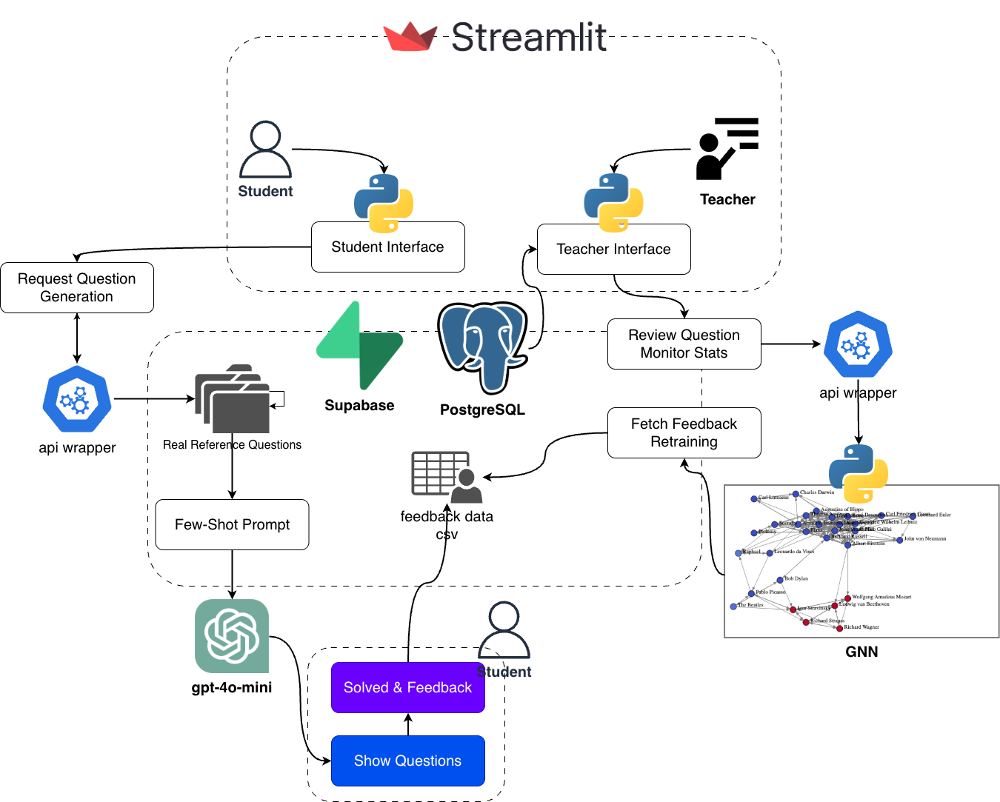

# computer-exam-problem

Streamlit 기반 정보교과 시험 문제 생성 및 피드백 시스템입니다.

## Architecture


## Key Capabilities
- 학생용 문제 생성/풀이 UI
- 교사용 검토/통계 UI
- LLM 기반 문제 생성 래퍼
- 피드백 CSV 저장
- GNN 난이도 예측 프로토타입

## Repository Layout
```text
computer-exam-problem/
├── app.py                  # 학생용 Streamlit 엔트리 포인트
├── teacher_feedback.py     # 교사용 Streamlit 엔트리 포인트
├── api.py                  # 문제 생성 래퍼
├── cache.py                # Redis 캐시
├── gnn_model.py            # GNN 난이도 예측기
├── augment_questions.py    # 문제 증강 도구
├── expand_questions.py     # 문제 확장 스크립트
├── generate_feedback.py    # 피드백 생성기
├── dummy_data_gen.py       # 더미 데이터 생성기
├── data_files/
│   ├── questions/          # 기본 문제 JSON
│   └── feedback/           # 피드백 CSV
├── requirements.txt
├── requirements-dev.txt
└── .env.example
```

## Getting Started
1. Python 3.12 권장
   ```bash
   python -m venv .venv
   source .venv/bin/activate
   ```
2. 의존성 설치
   ```bash
   pip install -r requirements.txt
   ```
3. 환경변수 설정
   ```bash
   cp .env.example .env
   ```
4. 앱 실행
   ```bash
   streamlit run app.py                # 학생용 인터페이스
   streamlit run teacher_feedback.py   # 교사용 인터페이스
   ```

## Environment Variables
| 변수 | 설명 | 기본값 |
| --- | --- | --- |
| `OPENAI_API_KEY` | OpenAI 백엔드 사용 시 필요 | 없음 |
| `GEMINI_API_KEY` | Gemini 백엔드 사용 시 필요 | 없음 |
| `AI_BACKEND` | 문제 생성 백엔드 선택 (`openai`, `gemini`) | `gemini` |
| `REDIS_URL` | Redis 캐시 서버 주소 | `redis://localhost:6379/0` |
| `LOG_LEVEL` | 애플리케이션 로그 레벨 | `INFO` |
| `LOG_FILE` | 로그 파일 경로 | `logs/app.log` |
| `DEBUG` | `True` 시 디버그 모드 | `False` |
| `TEACHER_PASSWORD` | 교사용 뷰 간단 패스워드 | `teacher2025` |

## Optional Services
- Redis 사용 시:
  ```bash
  docker compose up -d
  ```

## Utility Scripts
- `augment_questions.py`
- `expand_questions.py`
- `generate_feedback.py`
- `dummy_data_gen.py`

## GNN Difficulty Model
`gnn_model.py`는 `DifficultyPredictor` 클래스를 제공합니다.

```python
from gnn_model import DifficultyPredictor

predictor = DifficultyPredictor()
predictor.train_model(
    'data_files/questions/middle_school_questions.json',
    'data_files/feedback/feedback.csv'
)
predictor.save_model('models_saved/difficulty_model.pth')
```

## Troubleshooting
- API 키 오류: `.env` 확인
- 데이터 파일 오류: `data_files/questions/` 확인
- 의존성 오류: `pip install -r requirements.txt --upgrade`
